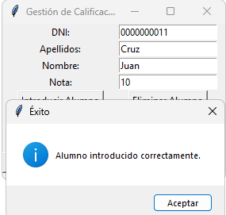
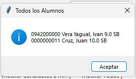
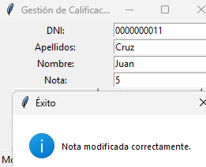
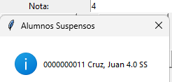
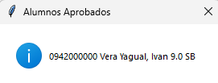

# Gestión de Calificaciones de Alumnos

Una aplicación de escritorio desarrollada en **Python** utilizando **Tkinter** como interfaz gráfica. Este programa permite gestionar las calificaciones de un grupo de alumnos, realizando varias operaciones como agregar, consultar, modificar y eliminar registros, además de mostrar informes específicos.

## Aplicacion .EXE
[Aplicacion](https://drive.google.com/file/d/1f6_o47eeQgtwsbj96ir9qzQD3iU6MwAt/view?usp=sharing)

## Características

- **Agregar alumno:** Introduce un nuevo alumno proporcionando su DNI, apellidos, nombre y nota.
- **Eliminar alumno:** Permite eliminar un alumno utilizando su DNI.
- **Consultar calificación:** Muestra la nota y la calificación de un alumno a partir de su DNI.
- **Modificar nota:** Actualiza la nota de un alumno y recalcula automáticamente su calificación.
- **Mostrar alumnos suspensos:** Lista los alumnos con nota inferior a 5.
- **Mostrar alumnos aprobados:** Lista los alumnos con nota igual o superior a 5.
- **Candidatos a matrícula de honor:** Muestra los alumnos con nota 10.
- **Ver todos los alumnos:** Muestra una lista completa de todos los alumnos registrados con su información.

## Capturas de Pantalla
<table>
  <tr>
    <td></td>
    <td></td>
    <td></td>
    <td></td>
    <td></td>  
  </tr>
</table>

## Requisitos

- **Python 3.x**: Asegúrate de tener Python instalado en tu sistema.
- **Tkinter**: Esta librería viene incluida con Python en la mayoría de las distribuciones.

## Instalación

1. Clona este repositorio:
   ```bash
   git clone https://github.com/IvanVY/Sistema-de-Calificaciones.git
